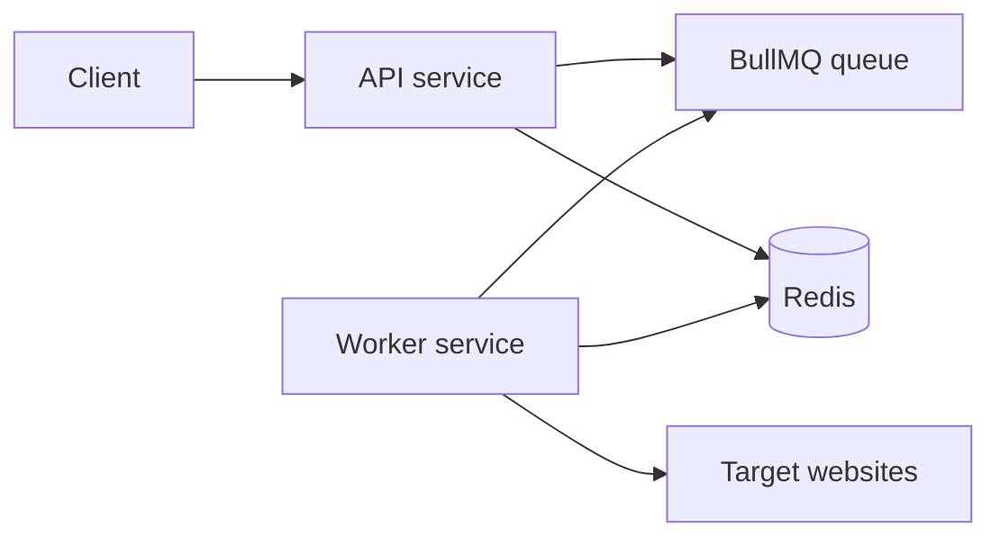

# web-crawler

=======

> > > > > > > f5e186a (initial commit)

# Stateless Web Crawler Backend

This is a Node.js + TypeScript crawler backend built around BullMQ and Redis.

It uses:

- Express for the API layer
- BullMQ for the queue
- Redis for job state, visited URL dedupe, and temporary results
- Cheerio for HTML parsing
- Built-in `fetch` for page retrieval

## Architecture



## Crawl Flow

1. `POST /crawl` validates and normalizes the seed URL.
2. The API route hands the request to a controller, which creates a crawl session in Redis and enqueues the root URL.
3. Workers pull URL jobs from BullMQ.
4. Each worker:
   - checks `robots.txt`
   - respects per-domain politeness delays
   - fetches the page
   - extracts title, description, and links
   - normalizes links
   - deduplicates URLs with a Redis `SET`
   - enqueues new URLs until depth is exhausted
5. Results are finalized idempotently in Redis.
6. When pending work reaches zero, the crawl is marked `completed`.

The API follows a lightweight MVC split:

- routes map HTTP paths
- controllers validate input and orchestrate the request
- services hold crawl-processing logic
- repositories wrap Redis persistence
- models hold the shared TypeScript shapes

`src/server.ts` is the API bootstrap, while `src/api.ts` remains as a thin compatibility entrypoint.

## Folder Structure

```text
.
├── Dockerfile
├── docker-compose.yml
├── package.json
├── yarn.lock
├── README.md
├── tsconfig.json
└── src
    ├── app.ts
    ├── api.ts
    ├── crawler.ts
    ├── server.ts
    ├── worker.ts
    ├── config.ts
    ├── controllers
    │   └── crawl.controller.ts
    ├── models
    │   └── crawl.model.ts
    ├── repositories
    │   └── crawl.repository.ts
    ├── routes
    │   └── crawl.routes.ts
    ├── services
    │   └── crawl.service.ts
    ├── queue.ts
    ├── redis.ts
    ├── store.ts
    ├── types.ts
    └── lib
        ├── domain.ts
        ├── fetch.ts
        ├── html.ts
        ├── http.ts
        ├── keys.ts
        ├── normalizeUrl.ts
        ├── politeness.ts
        ├── robots.ts
        └── time.ts
```

## API

### `POST /crawl`

Request:

```json
{ "url": "https://example.com", "depth": 2, "allowExternal": false }
```

Response:

```json
{
  "jobId": "c2a1f3...",
  "statusUrl": "/crawl/c2a1f3...",
  "resultsUrl": "/results/c2a1f3..."
}
```

### `GET /crawl/:id`

Returns crawl status and summary counters.

### `GET /results/:id`

Returns the aggregated crawl results from Redis.

## Redis Keys

- `crawl:{jobId}:meta`
  - Crawl metadata, status, counters, timestamps
- `crawl:{jobId}:visited`
  - Redis `SET` of normalized URLs already scheduled
- `crawl:{jobId}:finalized`
  - Redis `SET` of job ids already finalized
- `crawl:{jobId}:results`
  - Redis `HASH` of final result payloads keyed by job id
- `crawl:robots:{origin}`
  - Cached `robots.txt` text
- `crawl:domain:{origin}:next-at`
  - Per-domain politeness gate

## Queue Configuration

BullMQ jobs are configured with:

- `attempts: 3`
- `backoff: exponential`
- `removeOnComplete: true`
- `removeOnFail: true`

The worker concurrency is controlled by `WORKER_CONCURRENCY`.

## Environment Variables

See [`.env.example`](./.env.example).

## Local Setup

1. Install Redis.
2. Copy `.env.example` to `.env`.
3. Install dependencies:

   ```bash
   yarn install
   ```

4. Run the API:

   ```bash
   yarn dev:api
   ```

5. Run the worker in another terminal:

   ```bash
   yarn dev:worker
   ```

6. Start a crawl:

   ```bash
   curl -X POST http://localhost:3000/crawl \
     -H "Content-Type: application/json" \
     -d '{"url":"https://example.com","depth":2,"allowExternal":false}'
   ```

7. Poll status:

   ```bash
   curl http://localhost:3000/crawl/<jobId>
   ```

8. Fetch results:

   ```bash
   curl http://localhost:3000/results/<jobId>
   ```

## Docker

Build and run:

```bash
docker compose up --build
```

To scale workers:

```bash
docker compose up --build --scale worker=3
```

## Dokploy

Use the same image for two services:

- API service
  - command: `yarn start:api`
  - expose port `3000`
- Worker service
  - command: `yarn start:worker`
  - no public port

Point both services at the same Redis instance. You can use either a managed Redis or a Redis container in the same Dokploy stack.

## Production Readiness Notes

- Add request authentication or rate limiting for the API.
- Add pagination or streaming for large result sets.
- Increase crawl politeness for fragile sites.
- Consider a browser-rendering branch for JS-heavy pages.
- Add metrics and tracing for queue depth, fetch latency, and error rates.
- Add allow/deny lists if you only want to crawl approved domains.
- If you need stronger domain matching, switch from hostname matching to eTLD+1 matching.
  <<<<<<< HEAD
  =======
  > > > > > > > 8cf293d (initial commit)
  > > > > > > > f5e186a (initial commit)
